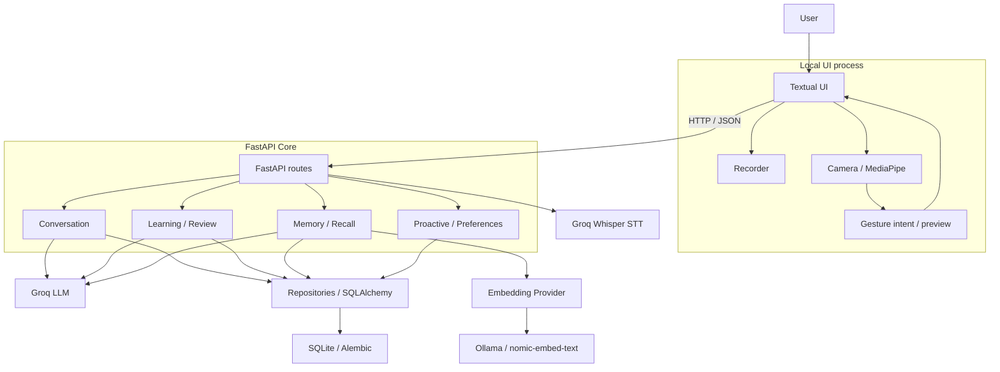
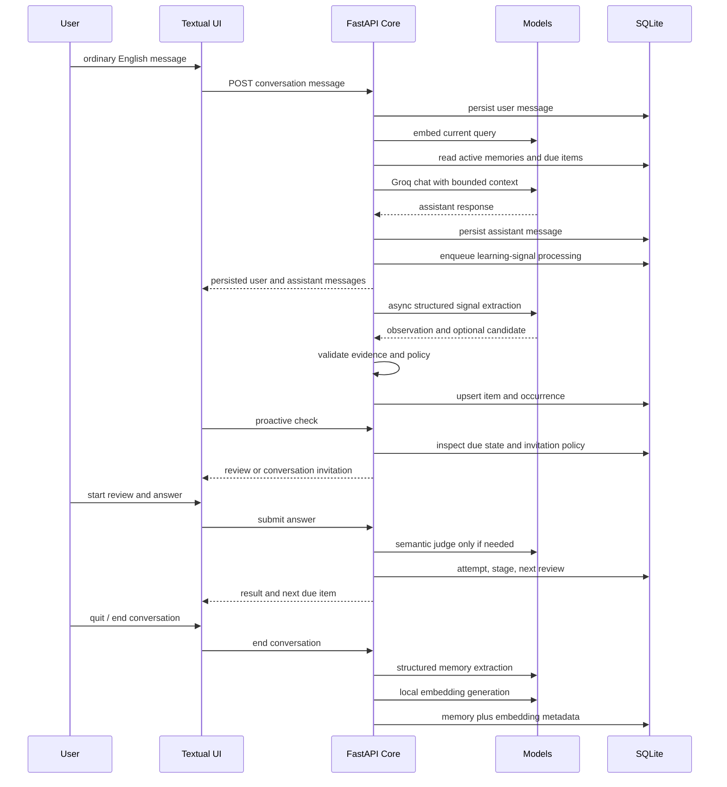
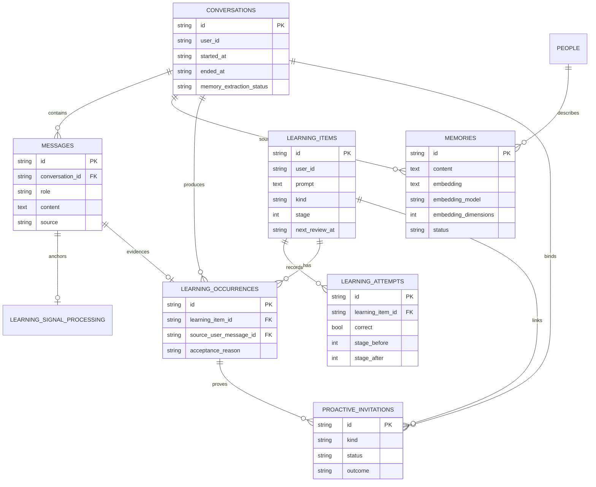

以下重建以目前可用 checkout 為準：

- 工作分支：`docs/architecture-research-foundations@afc9be5`
- 程式基準：`main@59ba15d`
- 兩者差異只有研究基礎文件，核心程式相同。
- 本輪未修改任何檔案。
- 我已讀取 implementation、設定、migration 與 tests；但無法在本環境重新執行 pytest，因 repository 內既有 `.venv` 的 Python 連結失效，而系統 Python 未安裝 pytest。以下測試結論來自測試程式與 assertion 的靜態交叉分析，不冒充本輪實際執行結果。

# 1. Project Overview

Teacher 是一套以 macOS、Textual 終端介面及本機 SQLite 為主要執行環境的單一使用者英文學習陪伴系統。Textual UI 不直接操作資料庫或模型，而是透過 HTTP/JSON 呼叫 FastAPI Core。Core 負責一般對話、語言協助、學習訊號擷取、Learning Item、Review 評分與排程、長期記憶、主動練習、偏好設定及語音轉錄邊界。

一般英文訊息先寫入 `messages`，再由 Groq 生成回覆；回覆成功後，系統另外建立可恢復的 learning-signal processing 工作，嘗試從這一組 user/assistant turn 擷取最多一個可複習內容。通過 Python 規則驗證後，才建立或合併 `LearningItem`，並以 `LearningOccurrence` 保存來源證據。Review 題目不是臨時生成，而是直接取用到期 Learning Item 的持久化 prompt；答案先做 deterministic normalization，再視需要呼叫 Groq 做受限的 structured semantic grading，最後由 Core 更新 stage、attempt 與下次複習時間。

長期記憶與學習資料是兩條不同資料流。對話結束後，Groq 從 user messages 抽取 Memory candidate；若啟用本地語意設定，Core 會透過 Ollama 的 OpenAI-compatible endpoint 呼叫 `nomic-embed-text`，把向量連同模型與維度存進 SQLite。未來聊天時，再以 lexical、人物命中及 cosine similarity 混合排序，選出少量記憶注入生成式 LLM。

因此，Teacher 並非只有「LLM API＋UI」：其主要工程內容是持久化學習狀態、非同步 signal processing、去重與來源追蹤、排程、受控評分、memory retrieval、failure recovery，以及 UI/Core/模型間的責任分離。

# 2. User-facing Capabilities

## 已完整串接

- `companion` 同時啟動 FastAPI Core child process 與 Textual UI，等待 `/health` 成功才顯示 UI。
- 一般英文對話、user/assistant message 持久化、有限對話歷史。
- Groq 生成式對話，預設模型 `openai/gpt-oss-20b`。
- 中文占比過高的一般輸入會被保存，但不送給模型，而是回覆英文輸入提示。
- `/help`、`/hint`、`/say`。
- `/help`、`/hint` 建立或合併 Learning Item；`/say` 不建立 Learning Item。
- 一般對話後的 durable learning-signal extraction。
- Learning Item、Occurrence、Attempt、固定間隔複習。
- due-first Review、deterministic grading、structured semantic fallback。
- `/remember`、`/memories`、確認式 `/forget`。
- 對話結束後 Memory extraction 與未來 conversation recall。
- in-app proactive invitation、Start／Later／Not today。
- learner preferences、onboarding、active/quiet hours、availability。
- assistant reply 失敗後，以既有 user message 做 idempotent retry。
- memory、conversation、learning、proactive、preferences 的 SQLite persistence。

## 已實作，但依賴外部環境或仍偏 experimental

- 本地語意模型：Ollama＋`nomic-embed-text`。程式路徑完整，但 Ollama 必須另行啟動，且自動化測試沒有真的連線到 Ollama。
- Spoken Review：macOS `sounddevice` 錄音＋Groq Whisper STT。
- Gesture Review：OpenCV＋MediaPipe Gesture Recognizer。
- Camera preview：本機 child process 擷取，Textual terminal 顯示。
- Groq live tests：需設定 `RUN_LIVE_API_TESTS=1` 與真實 API key。

## UI 存在，但後端或學習整合有限

- Speech 只支援 Review 作答，不支援一般 conversation 語音輸入。
- `Thumb_Down` 只取得 hint；不評分、不更新 learning state。
- `Thumb_Up` 只在 `REVIEW_COMPLETE` 狀態結束 UI celebration；不是答對手勢。
- Camera 只做 preview 與兩種 gesture intent，沒有物件辨識、OCR 或場景理解。
- `practice_balance` 可保存及顯示，但目前沒有被 proactive selection 消費；系統仍固定優先 due review。
- proactive review invitation 會啟動既有 Review，但 invitation 本身沒有保存 review outcome。
- `private_mode` 欄位存在，但建立 conversation 時永遠是 `False`。
- `COMPANION_POSE_MODEL` 仍可讀取，但 gesture adapter 已將它視為 no-op legacy argument。

## 文件提到，但無法由 repository 自動化證據獨立確認

- `FINAL_UAT.md` 記錄 target-Mac 實機 Speech／Camera／Gesture／Ollama 驗收，但 repository 沒有硬體錄影、原始執行 log 或可重現硬體測試。
- README 所稱的實機驗收狀態應視為專案驗收紀錄，而不是自動化 test proof。

# 3. System Architecture



實際 dependency direction 是：

```text
Textual UI
→ HTTP API
→ route orchestration
→ service / context builder
→ repository
→ SQLAlchemy Session
→ SQLite
```

外部模型則由 Core 呼叫：

```text
Core → Groq chat/completions
Core → Groq audio/transcriptions
Core → OpenAI-compatible embedding endpoint
```

幾個重要例外與細節：

- UI 會 import `companion.settings` 和 `companion.input_policy`，所以並非完全 package-independent；但它不 import ORM、repository 或 DB session。
- `/help`、`/hint`、`/say` 的 orchestration 位於 API route，不是一個獨立 LanguageService。
- Review hint 由 route 直接取得 `LearningService.review_prompt()`，再呼叫 LLM。
- `LearningService.answer()` 負責最終 grading decision 及 state mutation。
- 同一個 `ConversationService` 內部的 repositories 共用一個 SQLAlchemy Session，learning-signal processing 因而可以把 claim completion、occurrence 與 item capture 放在同一 transaction。
- 同一路由的不同 FastAPI dependencies 通常各自取得 Session，例如 conversation end 與 memory extraction 是先後兩次已提交的操作，不是單一跨服務 transaction。

## State ownership

- Conversation message persistence：`ConversationService`／`ConversationRepository`
- Learning Item 去重：`LearningRepository`
- Learning-signal claim、retry、lease：`LearningSignalProcessor`
- Grading、stage、next review：`LearningService`／`LearningRepository`
- Memory persistence：`MemoryService`／`MemoryRepository`
- Semantic ranking：`MemoryContextBuilder`
- Proactive eligibility、snooze、dismiss、practice outcome：`ProactiveService`
- Preferences：`PreferencesService`
- UI 只擁有 transient mode、目前題目、錄音、camera preview、pending retry 等呈現狀態。

# 4. End-to-End Runtime Flow



實際上 Learning 與 Memory 是兩條分支：

```text
Conversation turn
├─ successful ordinary turn → Learning Signal → Learning Item
└─ conversation end         → Life Memory extraction

Learning Item → Review → LearningAttempt / stage update → future due review
Life Memory   → hybrid recall → future conversation context
```

Memory 不會先變成 Learning Item；Learning Item 也不會被當成個人記憶。它們只會在下一次聊天時分別組成 system context。

# 5. Module-by-Module Breakdown

| Module | Responsibility / symbols | Dependencies | State ownership |
| --- | --- | --- | --- |
| `src/companion/cli.py` | `local()`、`core()`、Core readiness、child cleanup | Uvicorn、multiprocessing、UI runner | Process lifecycle |
| `src/terminal_ui/app.py` | `CompanionTerminal`、interaction modes、HTTP calls、rendering | Textual、httpx、recorder、gesture adapter | Transient UI state only |
| `src/companion/api/routes.py` | HTTP boundary、command dispatch、route-level orchestration | Services、providers | 不直接擁有 domain state |
| `src/companion/api/dependencies.py` | provider/service/repository wiring | Settings、Sessions | Dependency construction |
| `src/companion/conversation/service.py` | conversation lifecycle、reply、retry、context assembly | Conversation repo、LLM、Memory/Learning context | Conversation/messages |
| `src/companion/conversation/signal_processing.py` | durable signal enqueue、claim、lease、recovery | Session、LLM、LearningService | Processing ledger |
| `src/companion/learning/service.py` | assistance capture、signal validation、review、grading、schedule | Learning repo、grading policy、LLM boundary | Learning lifecycle |
| `src/companion/learning/repository.py` | item upsert、occurrence、due query、optimistic attempt write | SQLAlchemy Session | Learning persistence |
| `src/companion/memory/service.py` | remember、extract、validate、update、embedding write | Conversation repo、Memory repo、LLM、Embedding | Memory lifecycle |
| `src/companion/memory/context.py` | lexical/person/semantic ranking、prompt context | Memory repo、Embedding provider | Read-only retrieval |
| `src/companion/proactive/service.py` | eligibility、invitation、snooze、dismiss、practice reconciliation | Learning、Availability、Preferences | Proactive lifecycle |
| `src/companion/preferences/service.py` | onboarding、profile update/reset | Preferences repo | Learner preferences |
| `src/companion/providers/groq.py` | Groq chat、help、grading、memory/signal extraction | httpx、Pydantic schemas | 無 durable state |
| `src/companion/providers/embeddings.py` | OpenAI-compatible embedding client | httpx | 無 durable state |
| `src/terminal_ui/gestures.py` | child-process camera、MediaPipe、gesture gate | OpenCV、MediaPipe | Local transient state |
| `src/terminal_ui/recording.py` | 16 kHz mono in-memory WAV | sounddevice | Ephemeral audio buffer |
| `src/companion/persistence/models.py` | ORM table definitions | SQLAlchemy | DB schema |

# 6. Data Model

目前 ORM 沒有使用 SQLAlchemy `relationship()`；關聯透過 foreign key 與 repository query 手動處理。

| Table / model | 主要用途與欄位 | 建立／更新時機 |
| --- | --- | --- |
| `availability_overrides` | `user_id`, `state`, `starts_at`, `expires_at`, `source` | `/busy`、`/dnd`、`/available`；append-only 狀態紀錄 |
| `conversations` | mode、private flag、開始／結束時間、memory extraction bookkeeping | UI 建立對話、結束對話、啟動 recovery |
| `messages` | conversation、role、content、language、source、time | 一般輸入、redirect、`/say`、assistant reply |
| `people` | canonical name、aliases、relationship | Memory 分析或抽取涉及人物時 |
| `memories` | category、content、embedding、model/dimensions、person、source、confidence、status | `/remember`、對話結束 extraction、soft delete |
| `learning_items` | prompt、normalized identity、kind、answers、source、stage、next review | `/help`、`/hint`、conversation signal |
| `learning_attempts` | submitted answer、correct、stage before/after、time | resolved Review answer |
| `learning_occurrences` | item 與 source conversation/user/assistant message 的 provenance | conversation signal 通過驗證時 |
| `learning_signal_processing` | status、attempts、retryable、claim token、lease、completion | 每個成功 ordinary turn 的非同步 signal extraction |
| `proactive_invitations` | kind、status、suppression、starter、conversation evidence、outcome | proactive check/respond/finalize/abandon |
| `learner_preferences` | correction style、cadence、hours、balance、sound、onboarding | onboarding 或 `/preferences` |



## Migration evolution

- `0001`：Availability
- `0002`：Conversation／Message
- `0003`：People／Memory
- `0004`：Learning Item／Attempt
- `0005`：Proactive invitation
- `0006`：Memory embedding
- `0007`：合併舊的重複 learning goals，並轉移 attempts
- `0008`：Memory extraction bookkeeping
- `0009`：Embedding model／dimension identity
- `0010`：Learning occurrence provenance
- `0011`：Proactive practice outcome 與 evidence
- `0012`：恢復 `user_id + normalized_prompt + kind` identity
- `0013`：Learner preferences
- `0014`：Durable learning-signal ledger
- `0015`：Learning-signal claim lease

這個歷史顯示專案逐步從「存資料」進展到「來源追蹤、去重、失敗復原與 concurrent claim safety」。

# 7. LLM / AI Architecture

## A. Generative LLM

Production provider 是 `GroqLLMProvider`。

設定：

- Provider：Groq
- Chat API：`POST {GROQ_BASE_URL}/chat/completions`
- 預設模型：`openai/gpt-oss-20b`
- 預設 temperature：一般任務 `0.3`
- Learning-signal extraction、semantic grading：`0`
- Tests：`FakeLLMProvider`、`FailOnceFakeLLMProvider`

同一個 Groq generative model 被用於：

- 一般英文聊天
- `/help`
- `/hint`
- `/say`
- Learning Signal extraction
- Memory classification／extraction
- Review semantic grading

不是所有輸出都相同：

- Chat：自由文字
- Help／Hint／Say：JSON structured output，再經 mode-specific normalization
- Memory：Pydantic-validated JSON
- Learning Signal：`LearningSignalExtraction`
- Grading：`SemanticGradeDecision`

錯誤處理：

- 沒有 API key：configuration error
- 401／403：authentication error
- 429：rate-limit error
- 5xx／transport error：temporary error
- timeout：timeout error
- invalid JSON/schema：invalid-response error
- `_complete()` 只會對 `LLMTemporaryError` 自動再試一次；timeout 和 rate limit 不在這個內部重試範圍。
- Help 最多有兩次 structured repair；目前 HELP 模式即使第一次格式正確，也會做第二次 semantic review/repair。
- Provider 不會取得 Session 或 repository，因此不能直接寫入 stage、memory 或 scheduling。

## B. Local semantic / embedding model

這是先前容易被漏掉、但實際相當重要的 AI 元件。

### 使用什麼模型

文件與 `.env.example` 指定：

```text
Ollama
nomic-embed-text
768 dimensions
```

### 在哪裡載入

Teacher 本身不把 `nomic-embed-text` 載入 Python process。

實際流程是：

```text
Teacher Core
→ OpenAIEmbeddingProvider
→ HTTP POST http://127.0.0.1:11434/v1/embeddings
→ Ollama process 載入 nomic-embed-text
```

因此「模型載入」由外部 Ollama runtime 負責；Teacher 只是一個 OpenAI-compatible client。

### 是否完全本機

在 `.env.example` 的預設語意設定下，endpoint 是 `127.0.0.1`，所以 embedding inference 在本機 Ollama 執行。

但程式並沒有強制 `base_url` 必須是 localhost。使用者可把 `EMBEDDING_BASE_URL` 改為遠端服務；此時記憶與 query 文字就會送到該遠端 endpoint。因此更精確的說法是：

> Teacher 提供 provider-neutral embedding boundary；專案建議設定使用本機 Ollama／nomic-embed-text。

### 負責什麼

只負責：

- Memory content embedding
- Current conversation query embedding
- Semantic memory retrieval

不負責：

- 生成聊天內容
- Learning Signal extraction
- Review grading
- Learning scheduling
- Speech
- Gesture

### 寫入流程

```text
validated Memory
→ embed / embed_many
→ finite/dimension validation
→ JSON vector
→ memories.embedding
→ embedding_model
→ embedding_dimensions
```

Conversation-end 多筆候選會用單一 `embed_many()` batch。

### Retrieval/ranking

`MemoryContextBuilder` 最多讀取 200 筆近期 active memories：

- 人物 canonical name 或 alias 命中：`+10`
- 英文詞彙交集：每個 `+2`
- 中文 bigram 交集：每個 `+1`
- cosine similarity ≥ `0.35`：`similarity × 8`

最後依：

```text
hybrid score DESC
updated_at DESC
```

取最多 `MEMORY_CONTEXT_LIMIT`，上限為 5。

### Failure／disabled fallback

- `EMBEDDINGS_ENABLED=false`：完全不建立 query embedding，使用 lexical/person matching。
- 寫入 embedding 失敗：Memory 仍保存。
- query embedding 失敗：使用 lexical/person matching。
- model 或 dimensions 不一致：忽略該 stored vector。
- malformed、non-finite、空向量：忽略。
- Memory 內容變更但 re-embedding 失敗：清除舊向量，避免 stale vector。
- recall 不做 lazy backfill，也不修改 DB。
- 沒有 vector database；cosine 在 Python bounded candidates 上計算。

## C. Speech / Vision / Gesture

### Speech

- 錄音：`sounddevice.RawInputStream`
- 16 kHz、mono、16-bit PCM WAV
- 只保存在記憶體
- Core endpoint：`POST /v1/speech/transcriptions`
- 遠端模型：Groq Whisper `whisper-large-v3-turbo`
- Transcript 回到同一個 `/v1/review/{item_id}/answer`
- 不建立獨立 voice learning state

### Gesture

- Camera：OpenCV／AVFoundation
- Model runtime：MediaPipe Tasks Gesture Recognizer
- Model asset：由 `COMPANION_GESTURE_MODEL` 指定，不在 repository 內
- Inference：本機 child process
- 信心 threshold：`0.7`
- 需要連續 3 次穩定樣本
- cooldown：1 秒
- inference interval：0.1 秒

映射：

```text
Thumb_Down → UNCERTAINTY → existing review hint
Thumb_Up   → finish only after REVIEW_COMPLETE
```

### Camera preview

- 與 gesture inference 共用同一 camera capture。
- Preview 會 mirror，但 inference 使用未鏡像 frame。
- Child process 把縮小 RGB frame 經 JSON protocol 傳回 UI。
- UI 使用 one-slot latest-frame buffer；不形成無界 queue。
- 終端寬度小於 90 columns 時只隱藏 preview，不影響 review。
- 不進 Core、不進 Groq、不保存。

# 8. Conversation → Learning Pipeline

1. UI `ensure_conversation()` 建立 conversation。
2. 一般訊息送往 `POST /v1/conversations/{id}/messages`。
3. `ConversationService.send_user_message()` 先寫 user message。
4. 若輸入 materially Han-dominant：
   - source 設為 `language_policy`
   - 寫入固定 assistant redirect
   - 不呼叫 LLM
   - 之後也不進 provider context 或 learning-signal extraction
5. 一般英文輸入 source 為 `terminal`。
6. `ConversationService._generate_assistant_reply()`：
   - 取最近 N 筆 messages
   - 排除 blocked language-policy messages
   - 建立 Memory context
   - 建立 due Learning context
   - 呼叫 LLM chat
7. LLM 成功後寫 assistant message。
8. 只有 `source=terminal` 的 user message 會 enqueue `LearningSignalProcessing`。
9. Processing row 先持久化，再建立 async task。
10. 成功聊天只最多等待 signal task 10 ms，不讓 extraction latency 長時間阻塞 UI。
11. Processor 以 claim token 與 5 分鐘 lease 取得該 turn。
12. 最多 3 次 extraction attempt。
13. LLM 收到：
   - conversation ID
   - user/assistant message ID
   - user content
   - assistant content
14. LLM 回傳 correction observation 與最多一個 candidate。
15. Python 再驗證：
   - source IDs 必須完全相符
   - chitchat 不收
   - correction 必須是 high confidence
   - source excerpt 必須真的存在於 user content
   - correction 必須不同
   - prompt 必須未來可獨立理解
   - answer 不可過長、不可空白
16. 若 observation 有可靠 correction、但模型 candidate 為空，Core 可生成受控 correction question。
17. `LearningRepository.capture_occurrence()`：
   - 依 `user + normalized prompt + kind` upsert item
   - 依 `source_user_message_id` 防止重複 occurrence
18. 一般 conversation signal 的首次 review 設為一天後。
19. `/help`、`/hint` 則是明確 assistance，因此建立後立即 due。
20. `/say` 的 user message source 是 `say`，會進 conversation，也可被 Memory extraction 讀到，但不進 Learning Signal pipeline。

# 9. Review Lifecycle

```text
LearningItem.next_review_at <= now
→ first_due()
→ stored prompt
→ typed answer or STT transcript
→ deterministic normalization
→ semantic judge if unresolved
→ attempt + stage update
→ next due item
```

## 題目來源

Review question 直接來自 `LearningItem.prompt`，不是每次 review 再讓 LLM 出題。

## 評分

Deterministic fast path 支援：

- case／spacing／punctuation normalization
- exact accepted answer
- 有明確單一展開的 contraction，例如 `I'm ↔ I am`

對一般非相等答案，通常會進 semantic judge。Semantic judge 收到：

- review prompt
- item kind
- accepted answers
- submitted answer

只有：

```text
verdict=correct
target_preserved=true
```

才會答對。

若模型 uncertain、timeout、rate limit、invalid response：

- `correct=None`
- `grading_deferred=true`
- 不建立 attempt
- 不修改 stage
- 原題繼續讓使用者換一種說法

## 狀態轉移

答對：

```text
stage_after = stage + 1
```

答錯：

```text
stage_after = 0
```

排程：

```text
stage 1 → 1 day
stage 2 → 3 days
stage 3 → 7 days
stage 4 → 14 days
stage 5+ → 30 days
```

重要細節：

- 答錯後不是立刻重試同一題，而是回 stage 0、隔天再出現。
- 沒有 ReviewSession table；目前題目與位置在 UI transient state。
- `/review quit` 不修改 item，只退出 UI mode；下次仍可重新開始。
- 沒有 skip-one-item endpoint。
- `LearningRepository.record_attempt()` 用舊的 stage 和 due timestamp 做 conditional update，防止重複／過期 submission 同時更新同一題。
- Accepted answers 不包含在 `ReviewQuestion` response，避免提早洩漏。
- Review hint 是 read-only，不能建立 attempt 或改變排程。

# 10. Memory Lifecycle

```text
Conversation end
→ mark conversation ended/pending
→ collect non-blocked user messages
→ expose up to 50 existing memories to model
→ structured extraction
→ deterministic validation
→ optional embedding
→ atomic memory transaction
→ future hybrid recall
```

具體行為：

1. `end_conversation()` 先持久化 `ended_at` 和 `memory_extraction_status=pending`。
2. `MemoryService.extract_conversation()` 只把 user messages 放入 extraction request。
3. Assistant 內容不會成為 memory evidence。
4. Chinese-dominant blocked inputs被排除。
5. Candidate 的所有 `source_message_ids` 必須屬於 offered user messages。
6. Greeting-only candidate 被略過。
7. `updates_memory_id` 只能指向有提供給模型的 existing memory。
8. Exact duplicate 會更新既有 memory，不建立第二筆。
9. Candidate batch 的 DB 寫入是 atomic；其中一項驗證或寫入失敗，整批 rollback。
10. Embedding batch 失敗不會讓 memory transaction 失敗，而是以無向量方式保存。
11. 未來 conversation：
    - current message 先 embedding
    - 讀 active memories
    - hybrid ranking
    - 最多注入 5 筆
12. 低 confidence memory 會在 prompt 裡標示可能過時或不確定。
13. Deleted memory 在 repository query 就被排除。

Recovery：

- UI 正常退出時會同步呼叫 conversation end。
- 若 memory extraction 失敗，conversation 仍已結束。
- 建立下一個 conversation 時會尋找未結束、pending 或 failed 的舊 conversation，先完成或重試 extraction。
- 目前 DB 沒有持久化 memory failure 的 `retryable` boolean；所有 `failed` conversation 都可能在之後被重新嘗試。這比文件所寫的「依 retryability recovery」更寬鬆。

# 11. Proactive Practice Lifecycle

## Eligibility

UI 每隔 `COMPANION_PROACTIVE_POLL_INTERVAL_SECONDS` 呼叫 Core，傳入：

- `idle_seconds`
- `can_present`

Core 依序考慮：

1. UI 是否可顯示
2. Busy／DND
3. Active hours／Quiet hours
4. 是否已有 accepted conversation practice
5. 是否已有 pending invitation
6. snooze／dismiss／accepted cooldown
7. daily limit
8. idle threshold

有 due item 時優先 `review`；否則是 `conversation`。

## Invitation

Conversation starter 不是 LLM 生成，而是固定的四個 `STARTERS` 輪替。

決策：

- Start：`accepted`
- Later：`snoozed`，預設 30 分鐘
- Not today：`dismissed`，到本地時區下一天 00:00

## Review invitation

- Start 後呼叫 `LearningService.first_due()`。
- UI 進入與 `/review` 相同的 mode。
- 作答仍由 LearningService 更新。
- Proactive invitation 本身保持 `accepted`，沒有連回 LearningAttempt 或 review completion outcome。

## Conversation practice

1. Start 時 invitation 綁定目前 conversation。
2. UI 顯示固定 starter。
3. 使用者的下一個答案走 ordinary conversation API。
4. 因為 source 是 `terminal`，它同時進 Learning Signal pipeline。
5. UI 以回傳的 user/assistant message IDs 呼叫 practice complete。
6. Core 尋找完全相符的 LearningOccurrence。
7. Outcome 可能是：
   - `learning_signal_captured`
   - `completed_no_signal`
   - `completed_not_evaluated`
   - `evaluation_failed`
   - `abandoned`
8. 若 signal extraction 還在執行，practice 可先存為 `completed_not_evaluated`；signal task 完成後再由 reconciliation 補上最終 outcome。
9. Completion 使用相同 evidence 重送時具 idempotency。
10. UI 在 practice mode 阻止除 `/status` 外的 slash command；這個限制主要在 UI，不是 Core 對所有 route 的全域鎖。
11. Skip 會先呼叫 abandon，再清理 UI state。
12. Quit 必須先完成或 abandon active practice，否則取消退出。
13. Restart 時，Core 只接受綁定後「恰好一組 user＋assistant」作為可自動完成的 conversation practice；沒有答案、只有 user、或多組訊息則 abandon，避免猜測 evidence。

# 12. UI Architecture

Teacher 沒有多個 Textual `Screen` class；核心是一個 `CompanionTerminal` App。

主要 widgets：

- `Header`
- status bar
- `RichLog` transcript
- new-message affordance
- practice side panel
- review prompt／feedback／hint button
- camera preview
- onboarding panel
- proactive invitation panel
- three context-sensitive action buttons
- main `Input`
- `Footer`

Interaction modes：

```text
NORMAL
AWAITING_HELP_SENTENCE
AWAITING_HINT_SENTENCE
HELP_RESULT
REVIEW
PRACTICE_PROMPT
REVIEW_COMPLETE
```

初始化：

1. 建立 HTTP client。
2. 建立 recorder 與 gesture adapter。
3. 建立 UI-local state。
4. `on_mount()` 設定：
   - 每 5 秒 refresh state
   - camera preview refresh
   - proactive polling
5. 讀 `/v1/state`。
6. 詢問 onboarding offer。
7. 建立新 conversation。
8. 顯示 provider startup state。

UI/Core boundary：

- UI 不取得 SQLAlchemy Session。
- UI 不知道 accepted answers。
- UI 不計算 stage 或 interval。
- UI 不寫 invitation status。
- UI 不決定 memory candidate 是否有效。
- UI 保存目前 interaction mode、active item ID、pending assistant retry、pending completion evidence。
- Core failure 時 `_run_guarded()` 保留大部分 active mode，讓使用者重試。
- UI 沒有離線 message queue；輸入失敗後只顯示錯誤。

# 13. Configuration

## Core 與 persistence

| Setting | 作用 |
| --- | --- |
| `COMPANION_HOST`／`PORT` | FastAPI bind address |
| `COMPANION_DATABASE_URL` | SQLite URL，必須是 absolute path |
| `COMPANION_TIMEZONE` | 排程顯示與 proactive local date |
| `COMPANION_USER_ID` | 目前固定使用者 ID |
| `COMPANION_BUSY_MAX_DURATION_HOURS` | `/busy` 上限 |
| `CONVERSATION_CONTEXT_LIMIT` | 最近 conversation messages |
| `MEMORY_CONTEXT_LIMIT` | 注入 memories，上限 5 |
| `LEARNING_CONTEXT_LIMIT` | 注入 due learning goals，上限 5 |

## Generative LLM／STT

| Setting | 作用 |
| --- | --- |
| `LLM_PROVIDER` | `groq`、`fake`、`fake_fail_once` |
| `GROQ_API_KEY` | Groq credential |
| `GROQ_MODEL` | Chat、help、grading、memory、signal model |
| `GROQ_BASE_URL` | Groq OpenAI-compatible base |
| `GROQ_STT_MODEL` | 預設 `whisper-large-v3-turbo` |
| `LLM_TIMEOUT_SECONDS` | Groq chat/STT timeout |

沒有 local generative LLM provider。

## 本地語意模型

| Setting | 作用 |
| --- | --- |
| `EMBEDDINGS_ENABLED` | 啟用 semantic memory |
| `EMBEDDING_BASE_URL` | 預設 Ollama `127.0.0.1:11434/v1` |
| `EMBEDDING_API_KEY` | 遠端相容 endpoint 可使用 |
| `EMBEDDING_MODEL` | 預設 `nomic-embed-text` |
| `EMBEDDING_DIMENSIONS` | 預設 768 |
| `EMBEDDING_TIMEOUT_SECONDS` | Embedding timeout |

`Settings` class 的無環境預設是 disabled；但 `.env.example` 明確設成 enabled。因此是否「預設啟用」取決於使用者是否依 README 複製 `.env.example`。

## Proactive

- poll interval
- review idle threshold
- conversation idle threshold
- snooze minutes
- accepted cooldown
- daily limit

完成 learner preferences 後，rare／normal／frequent 會套用程式內固定 policy，不再使用大部分舊 runtime threshold。

## Gesture／logging

- `COMPANION_GESTURE_MODEL`
- `COMPANION_GESTURE_CAMERA_INDEX`
- `COMPANION_GESTURE_LOG_PATH`
- `COMPANION_CORE_LOG_PATH`
- `COMPANION_POSE_MODEL`：目前是 legacy no-op

# 14. Testing Strategy

Tests 想保證的主要 invariants 如下。

## Conversation

- user 與 assistant 都保存。
- provider failure 時 user message仍存在。
- assistant retry 不重複寫 user message。
- stale／non-user retry 被拒絕。
- blocked Chinese message不進後續 provider context。
- restart 後 conversation persistence 仍存在。

## Learning Signal

- successful chat path 不被慢速 extraction 阻塞。
- processing row 先持久化。
- claim lease 未過期時不能被第二個 worker 重複取得。
- 過期 owner 不能提交 occurrence。
- 最多三次 attempt，不留下永久 in-flight row。
- retry error detail 不保存 provider secret payload。
- 同一 user turn 最多一個 occurrence。
- `/say` 與其 retry 永遠不形成 conversation signal。
- greeting、錯誤 source ID、context-dependent prompt 被拒絕。
- first review 延後一天。

## Learning／Review

- 重複 capture 合併答案但不重設原排程。
- Help／Hint 同 prompt、不同 kind 時是不同 item。
- due item ordering 可重現。
- stale duplicate answer 不建立第二個 attempt。
- contraction normalization。
- semantic judge 只在 local path 無法確定時呼叫。
- uncertain/provider failure 不修改 state。
- typed 和 spoken transcript 共用相同 grading path。
- interval 最長固定為 30 天。
- Learning Item 與 Life Memory prompt section 分離。

## Memory／Embedding

- assistant message不能成為 memory source。
- greeting不保存。
- update target 必須是曾提供給模型的 memory。
- candidate batch atomic。
- exact duplicate 合併。
- deleted memory 不 recall。
- semantic paraphrase 可在零詞彙重疊時召回。
- query embedding failure fallback。
- embedding write failure仍保存 memory。
- model／dimension 不相容時忽略 vector。
- query path 不做 lazy vector mutation。
- candidate read 有上限。

## Proactive

- pending invitation 重複 check 取得同一筆。
- decision 是 atomic transition。
- Start 必須綁定目前 user 的 conversation。
- completion evidence 必須完全相符。
- completion idempotent。
- restart reconciliation 不從模糊訊息猜測 practice。
- busy、DND、hours、snooze、dismiss、cooldown、daily limit 的優先序固定。
- due review 優先 conversation practice。

## UI／Hardware boundary

- spoken transcript 只提交一次。
- cancel audio 不送 STT。
- 30 秒 timeout 不重複提交。
- microphone/STT failure 保留 typed fallback。
- gesture hint 不更新 learning state。
- Thumb Up 只在 review complete 有效。
- preview 是 latest-only、bounded、保留 aspect ratio。
- camera failure 不結束 review。
- invitation bell 尊重 `sound_enabled`。
- active practice 在 quit 前必須 terminalize。

## Migration／packaging

- Alembic upgrade/downgrade。
- 舊重複 Learning Item 合併且 attempts 不遺失。
- kind-aware identity migration 保留舊 stage、attempt、occurrence。
- 安裝後可在 repository 外 import Core/UI。
- 安裝後 Core 可離線啟動 `/health`。

測試限制：

- 大量 service tests 使用 `Base.metadata.create_all()`，migration 正確性由另外的 migration tests 承擔。
- UI tests 多為 mocked HTTP，不等同真實 UI＋Core＋hardware。
- Groq live tests是 opt-in。
- 沒有真正連接 Ollama／`nomic-embed-text` 的 automated live test。
- Gesture／microphone 自動測試主要使用 fake adapter 或 mocked dependency。

# 15. Current Technical Strengths

- UI 不直接操作 DB，state-changing policy 集中於 Core。
- Learning、Memory 分流清楚，沒有把生活事實和學習程度混在一起。
- Learning Signal 不只相信模型文字，還做 source-ID、source excerpt、confidence 與 standalone prompt 驗證。
- `LearningOccurrence` 讓 Learning Item 有可追蹤的來源。
- Durable signal ledger、claim token、lease 與 attempt limit，使非同步 extraction 可恢復且具 exactly-once effect。
- Assistant failure 不會假裝成功；user message保留且可 idempotent retry。
- Review scheduling 是 deterministic Python policy，LLM 只能提供 bounded semantic verdict。
- Semantic grading uncertain 時不把答案記成錯誤。
- Memory extraction 具 batch atomicity與 unauthorized update protection。
- Semantic retrieval 對 model／dimension compatibility 有明確防護。
- Local semantic model 與 generative LLM 分工清楚。
- Speech、gesture 被接到既有 Review state machine，沒有建立第二套不一致的 learning engine。
- Proactive conversation practice 以 message IDs 和 occurrence 建立 durable evidence，而不是只保存「使用者好像練過」。
- Migration 歷史實際反映資料模型演進，而不是只靠重建 DB。

# 16. Current Technical Limitations

## Confirmed limitations

- 單一 local user，沒有 authentication、帳號或同步。
- UI 每次啟動建立新 conversation，不恢復原本 UI session；舊未結束 conversation 會被 Core 結束並抽取記憶。
- Core 啟動不會自動執行 `alembic upgrade head`。
- 沒有 streaming response。
- 一般非 exact Review answer 高度依賴 Groq semantic judge；provider 不可用時只能 deferred。
- 答錯後排到隔天，沒有同一題的立即 retry policy。
- Proactive review invitation 沒有保存實際 review completion/outcome。
- `practice_balance` 尚未影響 proactive selection。
- `private_mode` 尚未實作。
- `pose_model` 已是 legacy no-op。
- `InvitationStatus.EXPIRED` 存在，但 runtime 沒有建立 expired transition。
- Memory extraction 的 retryable classification只存在 HTTP result；DB 沒有保存，因此所有 failed extraction 都可能被再次 recovery。
- Gesture model asset未附在 repository，必須外部提供。
- Speech 只支援 Review。
- Camera 沒有 vision understanding。
- 本地語意模型是獨立 Ollama service，不是應用程式內嵌模型。
- 向量以 JSON 存 SQLite，沒有 ANN index 或 vector database。
- 無 local generative LLM。

## Likely limitations

- Semantic recall 在 bounded 200 candidates 上逐筆 Python cosine，資料量變大後不適合作為大型 memory store。
- Learning-signal retry 不是常駐 worker；主要由新 conversation、retry path 或既有 task 完成事件驅動。長時間沒有新事件時，failed row 不會立即自動重試。
- Help 模式固定做兩次 LLM completion，可能增加 latency 與 API 成本。
- UI 顯示「Core unavailable 時可繼續輸入」，但沒有真正的離線 queue，失敗輸入需使用者重送。
- FastAPI 雖預設只綁 localhost，但本身沒有 API authentication；若改綁公開介面風險會增加。

## Documentation mismatch

- `LEARNER_PREFERENCES.md` 稱 sound 是「future proactive audio support」，但目前 `sound_enabled` 已控制 Textual invitation bell。
- 文件有時說 memory recovery「依 retryability」，但實作會列出所有 `failed` extraction 重新嘗試。
- README 把 semantic memory稱為 optional；class default 確實 disabled，但 `.env.example` 又明確 enabled，展示時應說明設定條件。
- 「Core owns retry evidence」只對 durable message/proactive evidence部分成立；UI 仍保存 transient `_pending_assistant_retry` 以控制按鈕與互動。
- Target-Mac UAT 是文件紀錄，無法僅由自動 tests證明硬體流程真的在目前機器執行過。

# 17. Repository Evidence Map

| Concept | Main implementation files | Tests | Database / Migration | Notes |
| --- | --- | --- | --- | --- |
| Conversation | `conversation/service.py`, `conversation/repository.py`, `api/routes.py` | `test_conversations.py`, `test_m1_commands.py` | `conversations`, `messages`; `0002` | User 先提交，assistant 可稍後 retry |
| Learning Signal | `conversation/signal_processing.py`, `learning/prompts.py`, `learning/signal_policy.py` | `test_conversation_learning_signals.py`, `test_learning_signal_evidence.py` | `learning_signal_processing`; `0014`, `0015` | Async、durable、lease、max 3 attempts |
| Learning Item | `learning/service.py`, `learning/repository.py` | `test_learning.py`, `test_m3_learning.py` | `learning_items`; `0004`, `0007`, `0012` | Identity 是 user＋normalized prompt＋kind |
| Provenance | `LearningRepository.capture_occurrence()` | conversation signal/proactive integration tests | `learning_occurrences`; `0010` | 一個 user message 最多一個 occurrence |
| Review | `LearningService.first_due()`, `answer()` | `test_learning.py`, `test_semantic_grading.py` | `learning_items`, `learning_attempts` | 無獨立 ReviewSession table |
| Scheduling | `REVIEW_INTERVAL_DAYS`, `_record_resolved_answer()` | interval/stale-submission tests | stage、`next_review_at`、attempt history | 1/3/7/14/30 天 |
| Grading | `learning/grading.py`, `providers/groq.py` | `test_semantic_grading.py`, provider tests | `learning_attempts` | LLM verdict 不直接寫 DB |
| Memory | `memory/service.py`, `memory/repository.py` | `test_memory.py`, `test_m2_memory.py` | `people`, `memories`; `0003`, `0008` | User-only evidence、soft delete |
| Embedding | `providers/embeddings.py`, `memory/context.py` | `test_embedding_provider.py`, `test_embedding_runtime.py`, semantic memory tests | embedding/model/dimensions; `0006`, `0009` | Ollama profile：nomic 768 |
| Semantic recall | `hybrid_relevance_score()`, `cosine_similarity()` | `test_hybrid_retrieval...`, `test_zero_overlap...` | Reads `memories` | top 5 from max 200 candidates |
| Proactive | `proactive/service.py`, `proactive/repository.py` | `test_proactive.py`, `test_m4_proactive.py` | `proactive_invitations`; `0005`, `0011` | in-app only，無 daemon |
| Speech | `speech.py`, `terminal_ui/recording.py`, speech route | `test_terminal_ui.py`, `test_api.py` | 無音訊表 | Groq Whisper，音訊不持久化 |
| Gesture | `terminal_ui/gestures.py`, `gesture_worker.py` | `test_gestures.py` | 無 | Local MediaPipe child process |
| Camera | `gestures.py`, `preview.py` | gesture/preview tests | 無 | Preview only，frame 不進 Core |
| Preferences | `preferences/service.py`, `preferences/repository.py` | `test_preferences.py` | `learner_preferences`; `0013` | balance 未消費，sound 已控制 bell |
| Availability | `availability.py`, `persistence/repositories.py` | `test_availability.py` | `availability_overrides`; `0001` | Busy 可過期，DND 無期限 |
| UI/Core boundary | `terminal_ui/app.py`, `api/routes.py` | `test_terminal_ui.py`, API integration tests | UI 無 DB ownership | HTTP/JSON、UI transient modes |
| Startup | `cli.py`, `main.py` | `test_cli.py`, packaging tests | 啟動不執行 migration | Core ready 後才啟動 UI |

總結一句：目前 Teacher 的真正核心，是「Groq 生成式模型＋本機 `nomic-embed-text` 語意模型」之外，還有一套由 Python Core 擁有的 conversation persistence、durable learning-signal processing、learning provenance、review state transition、fixed scheduling、memory retrieval、proactive lifecycle 與 multimodal UI boundary。這些部分都有實際程式與測試契約，不只是 README 中的概念描述。
